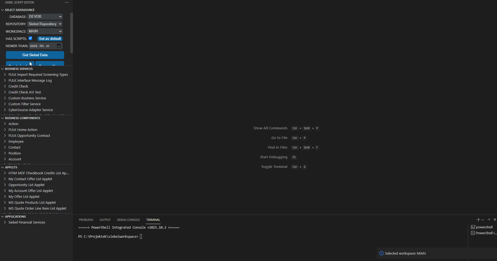

Siebel Script Editor is a Visual Studio Code extension, which enables editing Siebel object server scripts directly in VS Code, using a direct connection to the Siebel database.

[__See the full documentation for detailed installation and usage instructions__](documentation.md)

[Changelog](CHANGELOG.md)

# 1. Features

- Download Business Service, Business Component, Applet and Application server scripts from the specified database, repository and workspace (for workspace-enabled Siebel versions), and edit them with Visual Studio Code as javascript files.

  

- Pull (refresh) / push (upload) scripts from/to the Siebel database.

  

- Create backup of the specified database/repository/workspace:

  

- Snippets included for boilerplate code:

  

- Supports multiple Siebel database connections.

- Safe mode prevents overwriting scripts being worked on by other developers.

# 2. Requirements

The extension requires the 64-bit Oracle Client to be installed, see the [full documentation for detailed installation instructions](documentation.md).

# 3. Known Issues

- The extension supports Oracle databases only.
- Only one VS Code workspace folder is supported.
