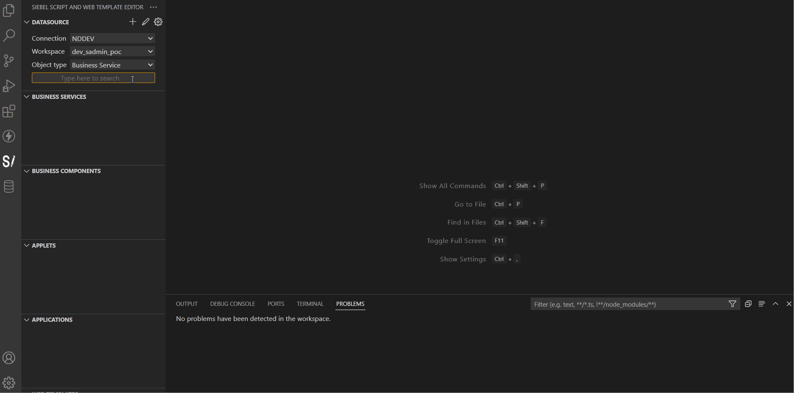

Siebel Script And Web Template Editor is a Visual Studio Code extension, which enables editing Siebel object server scripts and web templates directly in VS Code, using the Siebel REST API.

[__See the full documentation for detailed installation and usage instructions__](documentation.md)

[Changelog](CHANGELOG.md)

# 1. Features

- Download Business Service, Business Component, Applet, Application server scripts and Web Templates from a specified Siebel workspace, and edit them with Visual Studio Code, scripts as javascript and web templates as html files.

  

- Pull (refresh) / push (upload) scripts from/to Siebel.

  

- Snippets included for boilerplate code:

  

- Supports multiple Siebel connections, with multiple workspaces for each.

# 2. Requirements

- Siebel REST API and workspaces should be enabled.
[full documentation for detailed installation instructions](documentation.md).

# 3. Known Issues

- Currently only basic authentication is supported.
- Only one VS Code workspace folder is supported.
