Siebel Script Editor is a Visual Studio Code extension, which enables editing Siebel object server scripts directly in VS Code, using a direct connection to the Siebel database.

# 1. Installation

Prerequisites:
- siebelscripteditor-\<VERSION_NUMBER\>.vsix extension file [__Download Link__](../../raw/main/siebelscripteditor-1.0.0.vsix)
-	Visual Studio Code should be up-to-date
-	[64-bit Oracle Client](https://www.oracle.com/database/technologies/instant-client/downloads.html), follow installation instructions at the bottom of the link.

To install the extension (downloaded .vsix file) run the following command:
```
code --install-extension <DOWNLOAD_PATH>\siebelscripteditor-1.0.0.vsix
```

The command shall respond with:

```
Extension 'siebelscripteditor-1.0.0.vsix' was successfully installed.
```

> Some other/warning messages may be displayed, but that's OK as long as the installation is successful.

Start VS Code (or if it was already running, restart it). A new icon will appear in the left sidebar to access the extension's UI:


# 2. Usage

**IMPORTANT**: Make sure to open a folder before using the extension. It downloads scripts and other datafiles needed for its operation into this folder. You can name this folder any way you want (in the example below it's named `siebelvscodeworkspace`):

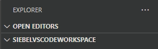

## 2.1. Configuration

After clicking on the extension's icon, a pop-up window tells that you do not have any database connections configured yet:

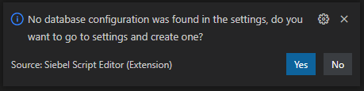

Click Yes to open to the extension's settings:

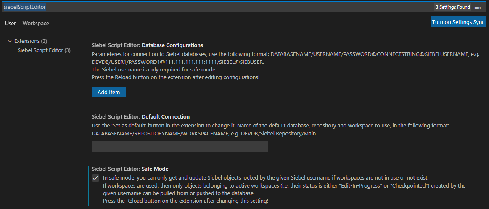

Currently there are three settings for the extension:
- __Database Configurations__: used for connecting to the Siebel databases. See [configuring database connections](#211-configuring-database-connections).
- __Default Connection__: the default database/repository/workspace to use on startup. Normally it should be set using the __Set as default__ button on the extension's UI.
- __Safe Mode__: turns safe mode on and off. In safe mode:
  - In Siebel versions without workspaces (pre-17): you can only get and update Siebel objects locked by the Siebel user provided in the database connection configuration's `SiebelUsername` component (see [configuring database connections](#211-configuring-database-connections)).
  - In workspaced Siebel versions (17+): you can only get and update Siebel objects belonging to active (Edit-In-Progress or Checkpointed) workspaces created by the Siebel user provided in the database connection configuration's `SiebelUsername` component (see [configuring database connections](#211-configuring-database-connections)).

### 2.1.1. Configuring database connections

To use the extension, at least one database connection must be configured. The connection is represented by a string of the following format:

```
ConnectionName/DBUsername/DBPassword@ConnectionString@SiebelUsername
```

Where:
- `ConnectionName` is a unique name to identify the connection. It is the name displayed in the extension's UI when selecting the connection. Use something that identifies the connection for you easily, such as SANDBOX, DEV, INT, etc.
- `DBUsername` is the Oracle database user name used to access the Siebel repository tables.
- `DBPassword` is the password of the Oracle database user given in `DBUsername`.
- `SiebelUsername` is used in safe mode to restrict access to objects "owned" by this user (see chapter above).

`ConnectionString` defines access to the Oracle database in the following format:

```
Host:Port/ServiceName
```

Where:
- `Host` is the URL of the Oracle database server.
- `Port` is the HTTP port where the Oracle database listens for connections.
- `ServiceName` is the SERVICE_NAME (not TNS name) of the Oracle database service.

For example, if the connection descriptor in `TNSNAMES.ORA` contains:

```
DEVDB=
  (DESCRIPTION =
    (ADDRESS = (PROTOCOL = TCP)(HOST = dbora01.dev.local)(PORT = 1521))
    (CONNECT_DATA =
      (SERVER = DEDICATED)
      (SERVICE_NAME = SBDEV)
    )
  )
```

then `ConnectionString` shall be `dbora01.dev.local:1521/SBDEV`, composed of the `HOST`, `PORT` and `SERVICE_NAME` values of the `TNSNAMES.ORA` entry.

> Assuming the DB user is SADMIN, it's password is SECRET and the developer's Siebel username is DEV_JOHN, the complete database connection config string is `DEV/SADMIN/SECRET@dbora01.dev.local:1521/SBDEV@DEV_JOHN`. The extension will display this connection as `DEV` in the database dropdown.

The connection is configured in the **Database Configuration** setting. You can provide multiple connections, which is useful if you have access to different environments/clients/etc.

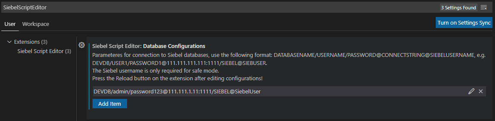

Use the **Add Item** button to add a database configuration. When done, click the **Test database connection** button in the extension's **SELECT DATASOURCE** panel:

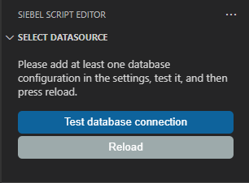

If the connection was established, the following message appears in the bottom right corner:

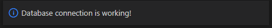

If the connection was unsuccessful, the error message will appear instead:

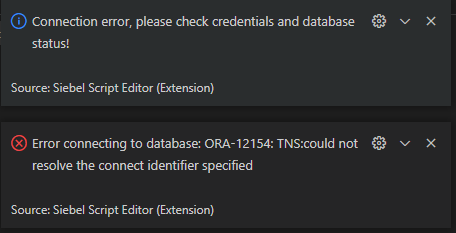

A successful connection enables the **Reload** button.

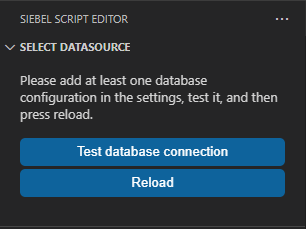

Add further connection configurations when necessary. Finally, click **Reload** to restart the extension. It will then read the connections and you can start working with the scripts.

In the future, when changing any setting, the extension should be reloaded with the **Reload** button.

> Alternatively, you can also restart VS Code.

## 2.2. User interface

Once a database connection is configured, the user interface of the extension becomes visible. The UI consists of five different panels, the uppermost selecting the datasource:

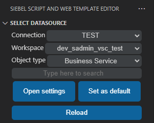

The other four panels display the list of Siebel objects (Business Services, Business Components, Applets and Applications) and their respective server scripts.

To get the list of objects, select the database, then repository and finally the workspace.

> If the Siebel version does not support workspaces, or workspaces are not enabled, the extension will detect it automatically, and the workspace selection list will be empty.

The **Has scripts** checkbox is used to get only objects that have any server scripts. If the checkbox is removed, all objects will be retrieved. This option only works for Siebel versions without workspaces, for workspace enabled Siebel versions, only objects with scripts will be retrieved, regardless of this setting.

Setting a date in **Newer than** will filter objects that were _created_ after the selected date.

Click the **Get Siebel Data** button to retrieve the list of Business Services, Business Components, Applets and Applications from the database:

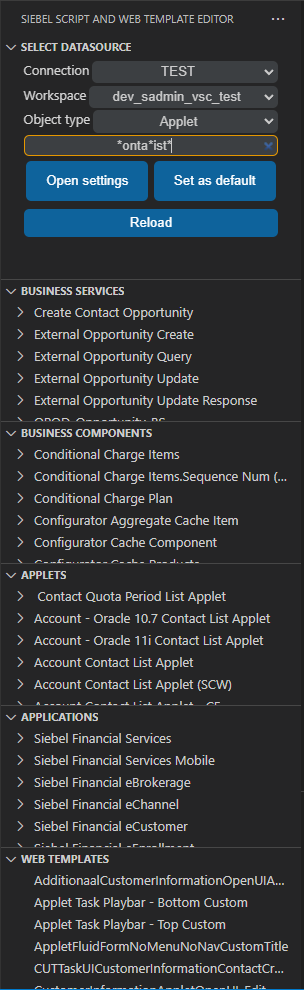

Other buttons:
- __Set as default__ saves the current connection (database, repository and workspace) as the default. The extension will set these values on next startup or reload.
- __Create backup__ creates a backup of all server scripts for the current query (see [](#223-creating-backups)).
- __Open settings__ opens the Siebel Script Editor extension's settings.
- __Reload__: Reloads the extension.

## 2.2.1. Getting scripts from the server

Click on an object and a dialog opens in the bottom right corner with three buttons:

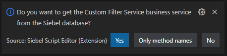

- __Yes__ gets and downloads all server scripts for the object.
- __Only method names__ gets only the method names. Methods can be downloaded individually by clicking on their names.
- __No__ closes the dialog.

Scripts are downloaded into the first VSCode workspace folder (only one should be open) in the following folder structure:

```
DatabaseName_RepositoryName\WorkspaceName\ObjectType\ObjectName
```

> For non-workspace enabled Siebel versions, the `WorkspaceName` component is omitted.

Refer to the [folder structure chapter](#3-folder-structure) for complete folder layout reference.


A checkmark is displayed in front of each object if there is at least one downloaded method. Checkmarks in front of method names indicate which methods are downloaded into the workspace folder:


The scripts are saved as javascript files with `.js` extension, and an `info.json` is created for each object to store the database name, repository name and id, workspace name and id (if used), and row ids of the siebel object and scripts. For the individual scripts, the last update from and last push to the database timestamp is also stored in `info.json`:

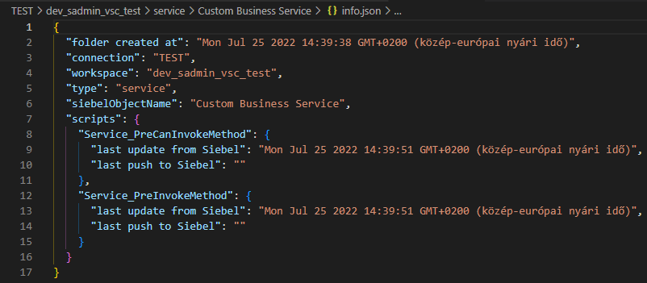

## 2.2.2. Refreshing (pulling) and updating (pushing) scripts

Two command buttons are shown in top right corner of the VS Code editor. The downward pointing arrow downloads (pulls) the script being edited from the database, while the upward pointing arrow uploads (pushes) it to the database, also updating the timestamp in the `updated` column:

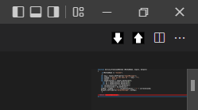

Both actions must be confirmed in the dialog displayed in the bottom right corner:

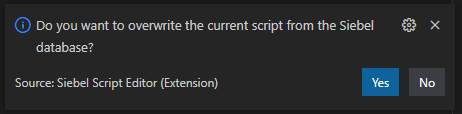


The following message is displayed after a successful push:

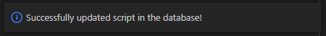

`info.json` is also updated:

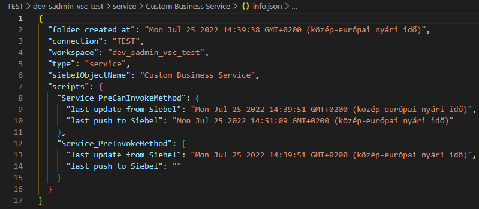

> __IMPORTANT__: In workspace enabled Siebel versions, editing server scripts, then checkpointing the workspace and subsequently editing already edited scripts in Siebel (web)tools creates a new versions of the scripts which are not the same as the ones edited in the extension. This case (a newer version of a script exists) is detected by the extension and will not allow pushing to the database. The affected scripts must be refreshed (pulled) either with the pull button, or from the the extension's UI (Siebel object tree view). The extension can only push and pull the newest version of server scripts.

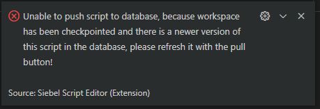

Possible errors when pushing scripts to the database:


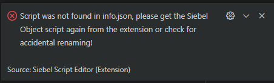

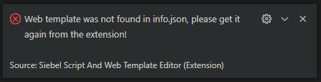

## 2.2.3. Creating backups
The **Create backup** button downloads all objects and their respective scripts from the current query after confirmation:

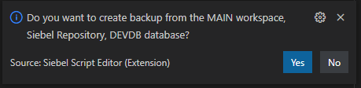

The backup is ready after the busy marker disappears:


The backup is saved into the currently open folder with a timestamp in the following structure:

```
DatabaseName_RepositoryName\WorkspaceName_backup_timestamp:
```

> For non-workspace enabled Siebel versions, the `WorkspaceName` component is omitted.

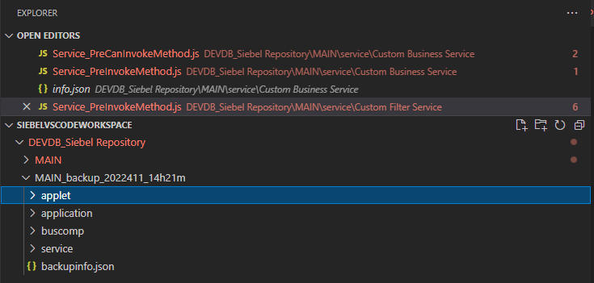

A `backupinfo.json` file is also created:

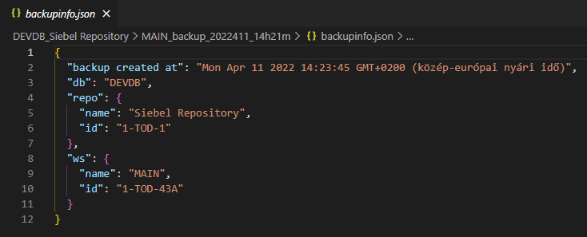

# 3. Folder structure

Folder structure for the scripts:
```
Visual Studio Code Workspace folder
├── Database Name_Repository Name
│   ├── Workspace Name
│   │   ├── service
│   │   │   └── Business Service Name
│   │   │       ├── Service_PreInvokeMethod.js
│   │   │       ├── CustomMethod.js
│   │   │       └── info.json
│   │   ├── buscomp
│   │   │   └── Business Component Name
│   │   │       ├── Buscomp_PreInvokeMethod.js
│   │   │       ├── CustomMethod.js
│   │   │       └── info.json
│   │   ├── applet
│   │   │   └──Applet Name
│   │   │       ├── WebApplet_PreInvokeMethod.js
│   │   │       ├── CustomMethod.js
│   │   │       └── info.json
│   │   ├── application
│   │   │   └───Siebel Application Name
│   │   │       ├── CustomMethod.js
│   │   │       └── info.json
│   │   └── Workspace Name_backup_timestamp
│   │       │   └───backupinfo.json
│   │       ├───sevice
│   │       ├───buscomp
│   │       ├───applet
│   │       └───application
│   └── Other Workspace Name
└── Other Database Name_Other Repository Name
    └── Another Workspace Name
        ...
```

[More information about `info.json` in this chapter.](#221-getting-scripts-from-the-server)